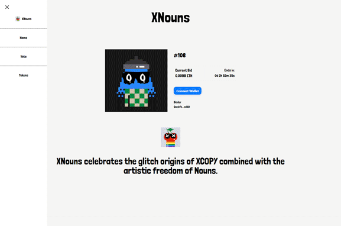

# Create DAO House



A repo to bootstrap your Nouns Builder DAO's website.

## Features

1. uses [NextJS](https://nextjs.org/); Server-Side Rendering
2. uses `Typescript`
3. uses [Tailwind](https://tailwindcss.com/) for styling
4. uses [wagmi](https://wagmi.sh/) + [rainbowkit](https://www.rainbowkit.com/)

## Getting Started

The application accepts the below environment variables, you WILL need to specify the network ID along with either a Curator ID or a Contract Address:

### ENV VARS:

```bash
NEXT_PUBLIC_ALCHEMY_API_KEY=
NEXT_PUBLIC_INFURA_API_KEY=

# token contract address
NEXT_PUBLIC_DAO_TOKEN_ADDRESS=

# nouns | modern | sleek
NEXT_PUBLIC_THEME_STYLE=

# OPTIONAL - leave blank to use DAO Name according to smart contracts
NEXT_PUBLIC_NAVBAR_TITLE=

```

## Develop

First, run the development server:

```bash
yarn dev
```

Open [http://localhost:3000](http://localhost:3000) with your browser to see the result.

You can start editing the page by modifying `pages/index.js`. The page auto-updates as you edit the file.

You can start editing the styling by modifying `styles/globals.css`. More detailed guide coming soon.

## Deploy on Vercel

The easiest way to deploy your Next.js app is to use the [Vercel Platform](https://vercel.com/new?utm_medium=default-template&filter=next.js&utm_source=create-next-app&utm_campaign=create-next-app-readme) from the creators of Next.js.

Check out our [Next.js deployment documentation](https://nextjs.org/docs/deployment) for more details.

Or click the button below:

[](https://vercel.com/new/git/external?repository-url=https%3A%2F%2Fgithub.com%2Fnickadamson%2Fcreate-dao-house&env=NEXT_PUBLIC_ALCHEMY_API_KEY,NEXT_PUBLIC_INFURA_API_KEY,NEXT_PUBLIC_DAO_TOKEN_ADDRESS,NEXT_PUBLIC_THEME_STYLE&project-name=our-dao-house&repo-name=our-dao-house&redirect-url=https%3A%2F%2Fcreate-dao-house.vercel.app)

...Don't forget to add the necessary environment variables!
